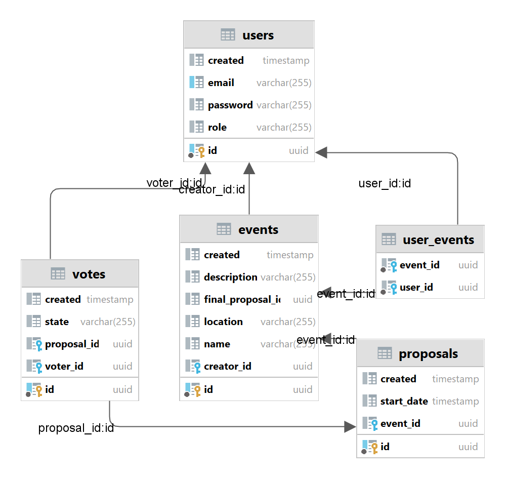

## Doodle Style Application Project

### Project Description:

The project involves creating a Doodle-style application dedicated to organizing events and meetings. 
The main functionality will enable users to create events with multiple date options. 
Invited participants will have the opportunity to vote on preferred dates, which will help determine the final and 
suitable date for everyone.

Key features include:
* event creation
* user registration and login
* registering users for events
* voting on preferred dates
* selecting the final event date
* event management - editing and deleting (for event creators only)

### Technologies

* PostgreSQL - database
* Spring Boot, JPA (Hibernate) - backend
* React - frontend

### Database Schema



### Application Launch

With Docker, the application can be launched with a single command. Simply go to the project folder 
(where the **docker-compose.yaml** file is located) and run the command:

```
docker-compose up -d 
```

By default, the application will be available on the following ports:

* PostgreSQL database: 5432
* Spring Boot backend: 8080
* React frontend: 3000

The application can also be launched in parts in the following order:

1. Database:
   ```
   docker-compose up -d db
   ```

2. Backend:
   ```
   docker-compose up -d backend
   ```

3. Frontend:
   ```
   docker-compose up -d frontend
   ```

### Backend Testing

Import the *backend* folder into IntelliJ: File -> Open.. Wait until Gradle downloads all dependencies and 
builds the project. To test the application, use the test runner (green arrow next to the test class name).


